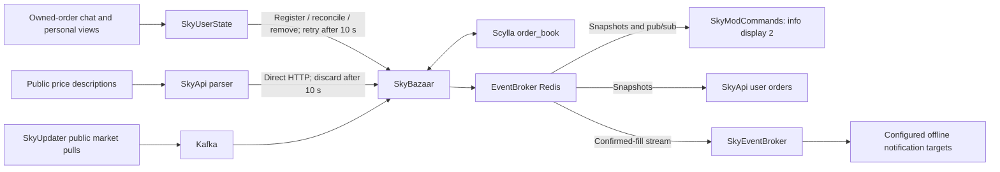

# Bazaar order updates

SkyBazaar is the authoritative matcher and fill-state owner. Tracking continues while a player
is offline; it does not require an open Minecraft socket or another visit to the order menu.

## Ownership, matching and confidence

SkyApi parses public price-book descriptions and starts a direct HTTP update to SkyBazaar.
Keep this path direct: moving it into the SkyUserState Kafka consumer adds avoidable latency.
SkyUserState identifies owned orders from chat and reconciles personal order views received
through ordinary description uploads. Those views improve accuracy; they are not required for
continued matching. The Fabric client needs no separate order-menu uploader.

- `POST /OrderBook` registers/upserts an owned order. Full-fill chat confirms `Filled = Amount`.
- `DELETE /OrderBook` removes claimed/cancelled orders by item, user and creation timestamp.
- `POST /OrderBook/player` reconciles a complete personal observation with `UserId`, `PlayerName`,
  `Timestamp`, and `Orders`. Delayed views cannot undo newer market fill changes; unchanged
  market ticks do not block corrections. The final reconciled state is published once per view.
- `POST /OrderBook/update` accepts parsed price levels directly from SkyApi. The public Kafka
  market feed uses the same matcher. These mutation endpoints are internal service APIs.
- `GET /OrderBook/user/{userId}` returns an authoritative snapshot and rebuilds its Redis cache.

A shrinking price level advances the FIFO queue and sets `IsEstimate = true`, even at 100%:
cancellations can also shrink a level. Personal views/chat confirm the observed quantity. A best
buy price strictly below a buy order, or a best sell price strictly above a sell offer, confirms
that order as fully filled. Being outbid/undercut and an empty price list do not confirm completion.
Missing confidence in older database rows or payloads is treated as estimated.

Owned orders, fill amounts and confidence are stored in Scylla/Cassandra `order_book`. Fully filled
orders remain in this ledger until claimed, cancelled, reconciled away, or expired, after leaving
the active matching queue. **Bazaar orders expire after seven days. The seven-day tracking lifetime
is intentional and matches the game; it is not an arbitrary retention limit or an offline defect.**
The snapshot TTL is refreshed on publication; order expiry follows the order timestamp.
An explicit `Expired!` personal observation also sets `IsExpired`, keeping its observed fill
count out of further matching. Expired entries may still have items awaiting collection.
`Filled` counts all fills; nullable `Claimed` counts withdrawals separately. For example,
Gill Membrane can be 1,024/1,024 filled, expired, with 512 claimed and 512 left to collect.
Partial claim chat updates only its order, preserving newer fills and the other orders.
It preserves the order until all items are withdrawn; claims do not emit
new completion alerts. UserState keeps observation timestamps so delayed menus cannot undo claims.

## Startup and temporary outages

Order restoration starts in the background independently of historical-table setup. The schema
check uses the existing order-book session/keyspace and adds missing nullable `has_been_notified`
and `is_estimate`, plus `is_expired`/`claimed` columns before reading orders. It does not backfill existing rows or open an extra
Cassandra session. Matching becomes ready immediately after restoring the ledger, before initial
snapshot broadcasts. Item-name lookups also do not delay publication.

Startup and readiness probes check `/ready` immediately, every three seconds, with no
fixed readiness delay. The startup probe retains a fifteen-minute failure budget. `/ready`
still requires recent successful database activity; matching endpoints additionally check
whether the order ledger has loaded.

While loading, owned-order mutations and authoritative snapshot reads return `503` with
`Retry-After: 10`. SkyUserState retains the captured observation and retries transient failures
after ten seconds without replaying transaction parsing. Direct SkyApi price uploads have only
ten seconds from observation to completion; expired requests are cancelled/dropped, never queued
for replay. SkyBazaar also rejects stale uploads and returns `false` during loading. The next
public market update seeds the fresh in-memory queue; the previous queue position is not restored.

The dedicated Redis connections allow disconnected startup, use a one-second connect/operation
timeout, and reconnect in the background. A publication failure retains the latest user snapshot
and all outstanding confirmed-fill events in memory for retry every ten seconds. A later claim
cannot erase an already pending fill alert. SkyModCommands retries initial subscription failure;
StackExchange.Redis restores established subscriptions after reconnecting.

## One Redis for Bazaar state and notifications

| Component | Bazaar connection |
| --- | --- |
| SkyBazaar publisher | `EVENTS_REDIS_HOST`, default `sky-event-broker-redis` |
| SkyApi snapshot reader | `EVENTS_REDIS_HOST`, same default |
| SkyModCommands snapshot reader/subscriber | `EVENTS_REDIS_HOST`, same default |
| SkyEventBroker consumer | Its existing `REDIS_HOST` connection to `sky-event-broker-redis` |

The Talos chart already supplies the shared EventBroker address. Other clusters must point
`EVENTS_REDIS_HOST` at that service or its mirror. Settings/API/mod Redis connections retain their
existing duties; changing generic Redis variables is unnecessary. The broker reuses its connection.

Redis key `bazaar:orders:v1:{userId}` holds a rebuildable snapshot for ten minutes; updates publish on
`bazaar:orders:v1`. Payloads contain `UserId`, `PlayerName`, `Created`, `Revision`, `Orders`
(including `Filled`, nullable `IsEstimate`, `IsExpired` and nullable `Claimed`), and `ItemNames`. Revisions use a process counter
seeded from UTC ticks rather than a disposable Redis counter, so ordinary restarts/cache loss do
not make readers reject new state. SkyBazaar remains a single authoritative matcher instance.

SkyApi's authenticated `GET /api/player/bazaar/orders` filters state by the API-key user and
Minecraft player, preserves customer history, and adds `filledAmount`/`isEstimate` plus `isExpired`/`claimedAmount`. It is not
publicly cached. Both this reader and HUD restoration request the authoritative snapshot when
Redis is missing/unavailable. The API falls back to observed player history with `isEstimate: true`
when an older or loading SkyBazaar cannot provide it.

Info display 2 remains gated to the exact test client version **`2.0.0-pre1`**, with expiry/claim counts,
confidence in hover text, reconnect restoration, the tutorial and the saved disable preference. Other mod
versions receive neither the order display nor its tutorial.

## Persistence and offline alerts

The Talos EventBroker Redis deployment now has an opt-in **200 MB (200,000,000 bytes)** Longhorn
volume. Other Redis deployments remain unchanged.
The rollout exhausted the original 32 MiB cap. Its data limit is now 50 MiB
with `noeviction`, leaving disk room for the previous and replacement RDB snapshots. This is a
capacity bound, not a prediction of future order/alert volume; write failures remain visible and
retry instead of evicting pending notifications. Longhorn replication adds physical storage cost.

Redis uses `save 5 1`: after writes, it schedules an RDB snapshot approximately every five seconds.
AOF is disabled to avoid a growing append log. The deployment uses `Recreate` with one RWO volume,
and the claim has Helm's keep annotation. Restart restores saved snapshots, alert entries, dedup
keys and consumer-group pending state. Writes since the last completed save can be lost; this is
not synchronous durability. See [Redis persistence](https://redis.io/docs/latest/operate/oss_and_stack/management/persistence/).

A Lua script saves/publishes the snapshot and appends confirmed completions to `bazaar:fills:v1`.
Stable order references and eight-day dedup keys suppress repeat enqueueing. Estimated completions and expired orders
do not alert. SkyEventBroker consumes the stream with group `sky-eventbroker-bazaar`, reclaims
abandoned pending entries after a minute, and atomically acknowledges/deletes them after successful processing.
Delivery is at least once; a crash after sending but before acknowledgement can repeat a delivery.

Configure a subscription with `SourceType: "bazaar"`, `SourceSubIdRegex: "filled"`, and existing
Firebase or Discord webhook targets for out-of-game alerts. `StoreIfOffline` also retains an
in-game message for reconnect through the broker's existing database. No user subscriptions or
targets are enabled automatically; SkySubscriptions' separate price-alert engine needs no change.

Cassandra and Redis remain separate writes, without a transactional outbox. Publication retries
are in memory. A simultaneous SkyBazaar crash before Redis accepts an event can lose that event,
especially if the order was already removed from the ledger. Restoring confirmed unclaimed orders
republishes them, but cannot reconstruct claimed/deleted orders. Do not describe this as guaranteed
end-to-end delivery. The accepted restart model trades exact queue recovery and a short durability
window for a small shared Redis and fast service startup.

## Compatibility and validation

Changes are additive: existing endpoints remain, nullable columns are created automatically, and
missing confidence defaults to estimated. New SkyUserState falls back to legacy order registration
when `/OrderBook/player` returns 404. Full view-based removal reconciliation requires the new
SkyBazaar; legacy chat cancellation/claim endpoints still work. New API readers can use old player
history until the new matcher is available. A mixed deployment keeps legacy behavior, but the full
new display/alert path requires all participating backends to be updated. Older SkyUserState does
not gain the new ten-second retry until it is updated.

No fixed service rollout order or manual schema step is required for API compatibility. Applying
the Redis persistence chart first is preferable to retain events once producers start. The first
move from an ephemeral pod to the PVC cannot recover that pod's unsaved memory. Deploy/test the
backends with `2.0.0-pre1` before distributing the client; the exact version gate stays in place.
These are prepared source/GitOps changes, not a live deployment.

Regression coverage includes startup rejection, stale-price drops, ten-second observation retries,
legacy API fallbacks, missing-cache restoration, estimated versus confirmed fills, pending event
retry after a claim, and new-mod HUD behavior. The real Redis integration tests accept
`BAZAAR_TEST_REDIS` pointing to an isolated Redis 7+ instance; never use production. A separate
SIGKILL/container-replacement check verified RDB recovery of the snapshot, stream and pending
consumer entry, followed by EventBroker processing those recovered entries.

Local C# validation required temporary MSBuild package-version overrides because the shared
`../dev` project is ahead of several consumer package pins. Tracked package versions were not
changed. Fabric `./gradlew test build` passed (54 core/mod tests plus 24 scenario-server tests).
Both persistence-enabled and legacy Helm configurations rendered, and the prepared Talos
PVC/Service/Deployment passed Kubernetes server dry-run validation.

For log categories, trace propagation, correlation fields and rollout metrics, see
[Bazaar rollout diagnostics](BAZAAR_DIAGNOSTICS.md).
